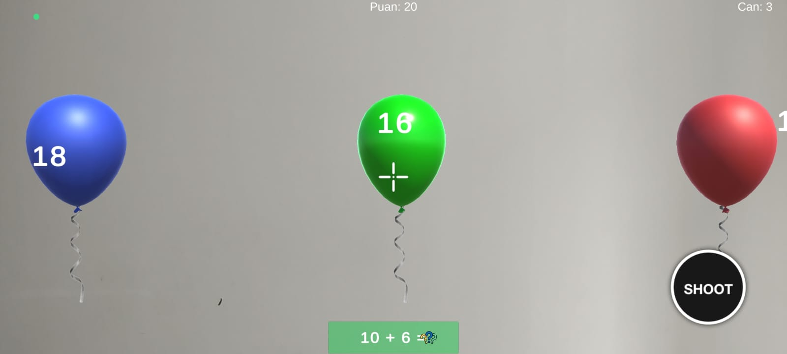

<body>

<h1>🎈 AR Balon Patlatma Oyunu</h1>

Bu proje, Unity ile geliştirilmiş, AR (Artırılmış Gerçeklik) teknolojisini kullanan eğitici bir matematik oyunudur. Oyuncular, gerçek dünya üzerinde beliren balonları patlatarak matematik becerilerini geliştirebilirler.

<a href="https://www.youtube.com/watch?v=JQCE79prn0k">🎬 Oyun Tanıtım Videosu</a>

<a href="https://drive.google.com/file/d/1pAwp147_oUpoS17l3FdGiRdmYSkaE8ub/view?usp=sharing">📥 Uygulama APK Linki</a>

<h2>🗂️ Proje Yönetimi</h2>

<a href="https://trello.com/b/AaLVJ1e0/proje-ekipi">Trello Board</a>

<h2>🌐 Web Site</h2>

<a href="https://novakids-tech.github.io/novakids_techOfficewebsite/#home">Web Site</a>

<h2 class="text-2xl font-bold mb-4">👨‍💻 Ekibimiz</h2>
<ul class="list-disc list-inside text-lg">
  <li><strong>Abdulkadir Erbaş</strong> — 200541017</li>
  <li><strong>İbrahim Halil Demir</strong> — 210541017</li>
  <li><strong>Hasan Hüseyin Kılıç</strong> — 220541109</li>
  <li><strong>Ömer Faruk Karaoğlan</strong> — 200541045</li>
</ul>

### Dokümanlar / Documents
- [Aktivite Diyagramı](Documentation/AR_Balon_Patlatma_Activity_Diagram (1).png)
- [Teknoloji Hazırlık Seviyesi (THS) 7 Belgesi](public/documents/lessons_1_20241113210805.xlsx)
- [Gantt Şeması](Documentation/AR_Balon_Patlatma_Gantt (1).png)
- [Deployment Diyagramı](Documentation/Deployment-Diyagramı.jpg)
- [Package Diyagramı](Documentation/Package Diyagramı.png)
- [UseCase Diyagramı](Documentation/balloonusediyagram.vsdx)
- [Smart Analizi](Documentation/smart.pdf)
- [Swot Analizi](Documentation/swot_analizi.png)
- [UML Diyagramı](Documentation/umlDiyagram.png)

## Oyun Görseli

> Geliştirdiğimiz AR Balon Patlatma Oyunu'na ait örnek bir ekran görüntüsü.

<h2>🕹️ Oynanış</h2>
<ol>
  <li>Oyun başladığında bir bonus turla karşılaşırsınız. Bu turda tüm balonları patlatarak puanınızı artırabilirsiniz.</li>
  <li>Bonus turdan sonra ekranda matematik soruları görünmeye başlar (örn: "5 + 3 = ?").</li>
  <li>Sorunun cevabını içeren balonu bulup patlatmanız gerekir.</li>
  <li>Doğru balonu patlatırsanız 10 puan kazanırsınız.</li>
  <li>Yanlış balonu patlatırsanız 1 can kaybedersiniz.</li>
  <li>Balonlar zamanında patlatılmazsa 1 can kaybedersiniz.</li>
  <li>Canınız sıfıra düştüğünde oyun sona erer.</li>
</ol>

<h2>⚙️ Sistem Özellikleri</h2>
<ul>
  <li>Rastgele matematik soruları üretme (toplama, çıkarma, çarpma, bölme)</li>
  <li>AR kamera ile gerçek dünyada balonları görme ve vurma</li>
  <li>Farklı renklerde balonlar</li>
  <li>Puan sistemi ve can mekanizması</li>
  <li>Bonus tur sistemi</li>
  <li>Yüksek skor takibi</li>
</ul>

<h2>📁 Proje Yapısı</h2>
<ul>
  <li><strong>GameManager.cs:</strong> Oyun durumunu (skor, can, oyun sonu) yönetir. UI günceller ve yüksek skoru kaydeder.</li>
  <li><strong>MathProblemGenerator.cs:</strong> Rastgele matematik soruları üretir. Toplama, çıkarma, çarpma, bölme desteği vardır.</li>
  <li><strong>SpawnScript.cs:</strong> Balonları aralıklı olarak oluşturur, bonus turunu yönetir.</li>
  <li><strong>BalloonScript.cs:</strong> Balonun hareketini, patlatıldığında olacak olayları ve cevap kontrolünü yönetir.</li>
  <li><strong>BalloonAnswerManager.cs:</strong> Doğru cevabı balonlara rastgele dağıtır.</li>
  <li><strong>ShootScript.cs:</strong> Oyuncunun tıklama/dokunma hareketlerini algılar, AR ışını göndererek balonu tespit eder.</li>
</ul>

<h1> Kurulum ve Çalıştırma Rehberi</h1>

Bu rehberde, <strong>AR Mobil Balon Oyunu</strong> projesini nasıl indirip çalıştıracağınızı adım adım ve sade bir şekilde anlatıyoruz.

<h2>1️⃣ Projeyi Bilgisayarınıza İndirin</h2>

Terminal veya komut satırını açın ve:

<pre><code>git clone https://github.com/NovaKids-Tech/AR_Mobile_Game.git</code></pre>

<h2>2️⃣ Proje Klasörüne Girin</h2>
<pre><code>cd AR_Mobile_Game</code></pre>

<h2>3️⃣ Unity Hub ile Projeyi Açın</h2>

Unity Hub'ı açın ve <code>Add</code> butonuna tıklayıp proje klasörünü seçin.

<h2>4️⃣ Gerekli AR Paketlerini Yükleyin</h2>
<ol>
  <li><code>Window > Package Manager</code> seçeneğini açın.</li>
  <li><code>Unity Registry</code> kısmını seçin.</li>
  <li>Şu paketleri yükleyin:
    <ul>
      <li>AR Foundation</li>
      <li>Android: ARCore XR Plugin</li>
      <li>iOS: ARKit XR Plugin</li>
    </ul>
  </li>
</ol>

<h2>5️⃣ Android veya iOS Cihaza Derleyin</h2>
<ol>
  <li><code>File > Build Settings</code> menüsüne gidin.</li>
  <li><code>Android</code> veya <code>iOS</code> seçin ve <code>Switch Platform</code> tıklayın.</li>
  <li>Cihazınızı USB ile bağlayın.</li>
  <li><code>Build And Run</code> ile cihaza yükleyin.</li>
</ol>

<h2>6️⃣ Cihazınızın AR Desteğini Kontrol Edin</h2>
<ul>
  <li>Android: ARCore destekli olmalı.</li>
  <li>iOS: ARKit destekli olmalı.</li>
</ul>

<h2>✅ Kurulum Tamamlandı!</h2>

Artık oyuna başlayabilir, doğru sayılı balonları patlatarak eğlenebilirsiniz! 🎈🎯💥

<h2>⚙️ Oyun Ayarları</h2>

Scriptlerde düzenleyebileceğiniz parametreler:

<ul>
  <li><code>spawnInterval</code>: Balonların oluşturulma sıklığı (saniye)</li>
  <li><code>spawnWidth</code>: Balonların yatay dağılım genişliği</li>
  <li><code>balloonsPerSet</code>: Her sette oluşturulacak balon sayısı</li>
  <li><code>moveSpeed</code>: Balonların yukarı hareket hızı</li>
</ul>

<h2>Geliştirme Notları</h2>
<ul>
  <li>AR Foundation kullanıldı.</li>
  <li>TextMeshPro ile metinler hazırlandı.</li>
  <li>3D modellerde BoxCollider kullanıldı.</li>
  <li>Skorlar ve can bilgileri <code>PlayerPrefs</code> ile kaydedilir.</li>
</ul>

<h2>Gelecek Geliştirmeler</h2>
<ul>
  <li>Farklı zorluk seviyeleri</li>
  <li>Çeşitli matematik işlemlerinin seçimi</li>
  <li>Ses efektleri ve müzik</li>
  <li>Görsel efekt iyileştirmeleri</li>
</ul>

  
Firma: <strong>NovaKids.Tech</strong> 
  İletişim: <a href="mailto:NovaKids.Tech@gmail.com">NovaKids.Tech@gmail.com</a>

</body>
</html>
